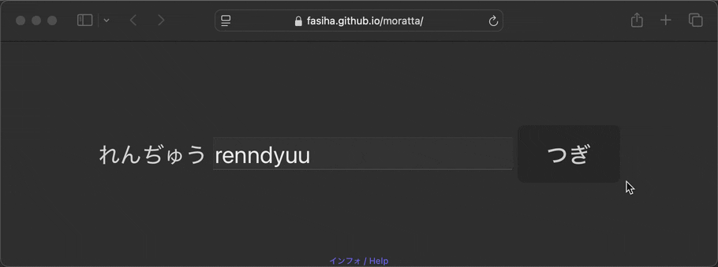

# Moratta

A simple app for me to grind hiragana and katakana using real vocabulary.

## Usage

Go to https://fasiha.github.io/moratta/ and convert each word to roumaji.



For words where ん (or ン) is followed by あいうえお or や or ゆ etc., like maybe しんいち, you enter a double `nn` just like when typing on IME: `shinnichi`. (Though `shinichi` is technically wrong, we'll accept it because this isn't an IME.)

And in general, both `n` and double `nn` are allowed for ん/ン.

づ and ヅ are `du`.

つ and ツ can be `tsu` or `tu`.

フィ is `fi` or `fyi`.

っち is `tch` or `cch`.

し and シ can be `shi` or `si`.

じゅ can be `ju` or `jyu`.

ぢゃ, ぢょ, ぢゅ, and ぢ are spelled with `d`, so `dya`, `dyo`, `dyu`, and `di` respectively.

There's no way to see what the "right" answer is in the website but the answer key is [here](./scripts/examples.json) (with the above rules). If you think we should add another roumaji answer, open an [issue](https://github.com/fasiha/moratta/issues) or [get in touch](https://fasiha.github.io/#contact).

The site doesn't use any spaced-repetition system, since the goal is to make sure you know _all_ the moras (hiragana and katakana syllables). On initial page load, we shuffle the order of moras you'll be quizzed on, and each time you convert a word to roumaji, we move all the moras you just answered to the end of the list.

## Words

The words are sourced from [JMDict Simplified](https://github.com/scriptin/jmdict-simplified) which is sourced from the famous [JMDict](https://www.edrdg.org/jmdict/j_jmdict.html) Japanese–English dictionary everyone uses.

See this [script](./scripts/extractExamples.ts) for how we pick a handful of words for each hiragana and katakana mora. It tries to find "common" words that use each mora, but failing to find sufficient examples, will look for uncommon words.

To rerun it,

1. Download a recent [release](https://github.com/scriptin/jmdict-simplified/releases) of JMDict Simplified
2. place `jmdict-eng-3.6.1.json` in the same directory as the script (`./scripts`),
3. (optional: if you downloaded a newer version, change the `JMDICT_FILENAME` in the script accordingly),
4. run `node --experimental-transform-types extractExamples.ts` (assumes a recent Node that can run TypeScript files).

This updates the answer key in [`examples.json`](./scripts/examples.json).

## Dev

Install [Git](https://git-scm.com) and [Node.js](https://nodejs.org).

Clone this repo:

```bash
git clone https://github.com/fasiha/moratta.git
cd moratta
```

Install dependencies:

```bash
npm install # or `pnpm install` or `yarn install`
```

To run the app in the development mode ([http://localhost:5173](http://localhost:5173)):

```bash
npm run dev
```

To build the app for production in the `dist` directory:

```bash
npm run build
```

After building, commit and push to GitHub to update the website:

```bash
git add dist -f
git commit -am dist
git push
```

## Reviews data

Forthcoming. (We do log each review (each time you enter the correct roumaji) in your browser's IndexedDB. We should allow you to export to for analysis.)
